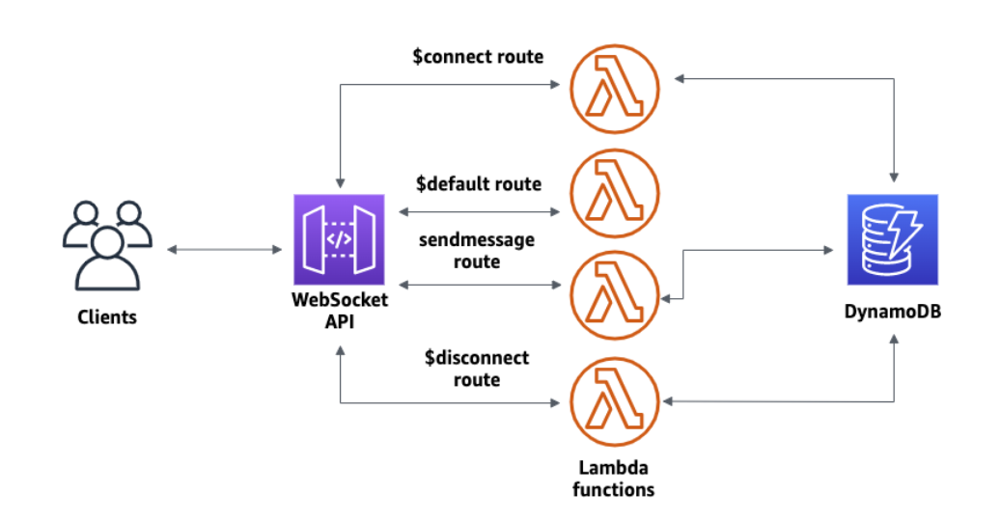

Utilisation de terraform.

## 1-creer table dynamodb nom à personnaliser, et key de partition : connectionId ##

## 2-creation function lambda (4) codes joints au projet ##
choisir nodejs16.x

- une pour connect
- une pour disconnect
- une pour default
- une pour sendmessage
le role sera indiqué avant le lab

- contexte

- déclencheur exemple

## 3-creation apigateway  websoket avec 4 routes prédefinies : ##
Route selection expression : $request.body.action
Routes prédéfinies :
- $connect
- $disconnect
- $default
- sendMessage

  lambda integration en liant les fonctions crées précedement

exemple route $connect

## 4- test ##
postman new websocket test, 
- connect
- wss://<id api>.execute-api.us-east-1.amazonaws.com/<stage>/
- send
- {"action": "sendMessage", "message": "hello, everyone!"}
